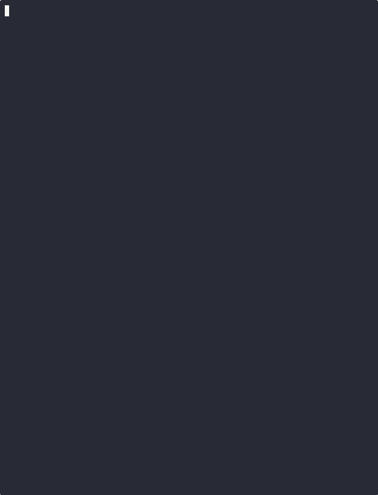
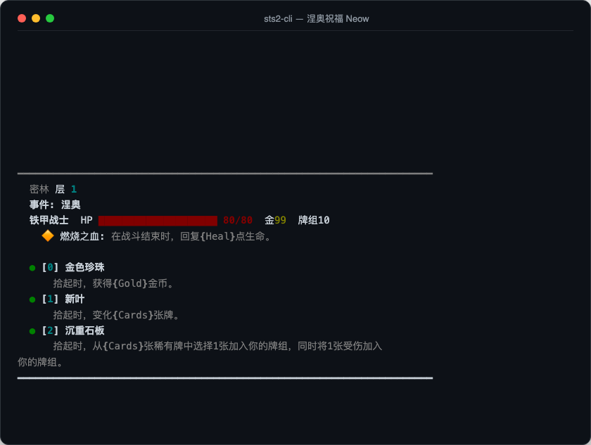
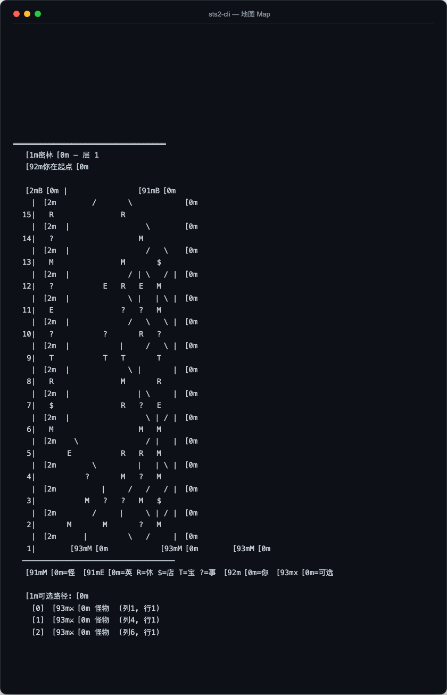
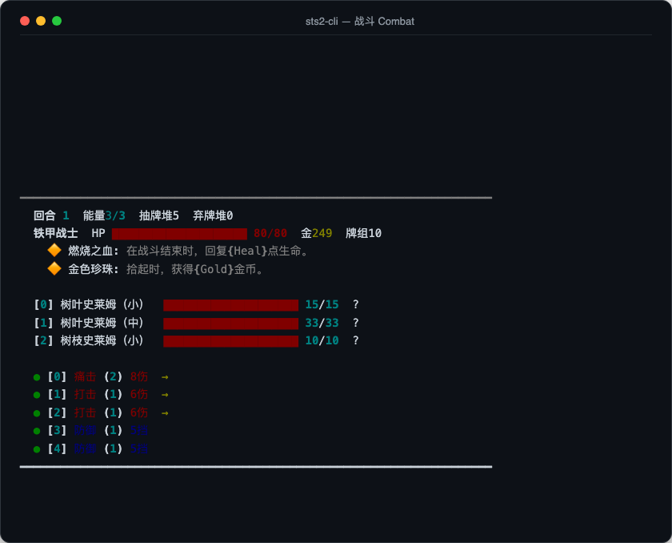
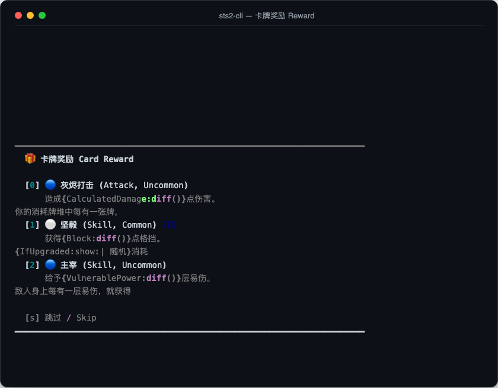
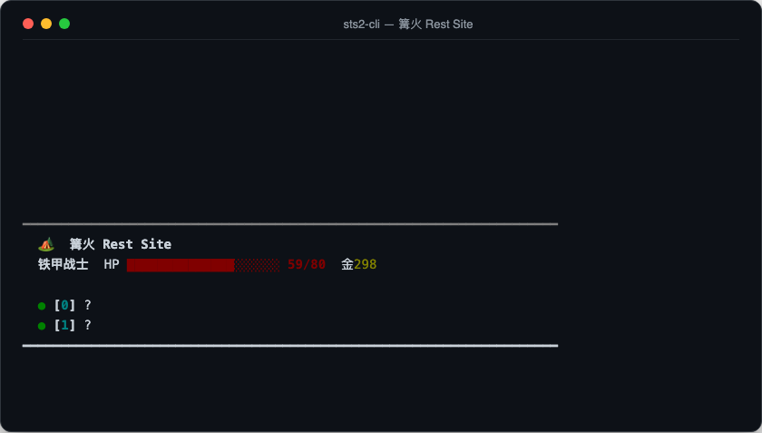
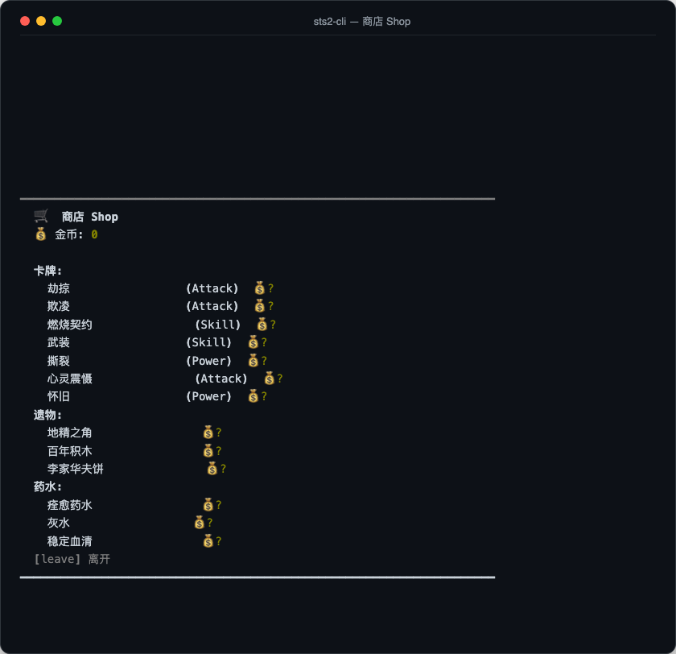

# sts2-cli

Play Slay the Spire 2 in your terminal.

Runs the real game engine (sts2.dll) headless — no GPU, no UI, no Godot. All damage, card effects, enemy AI, relics, and RNG are identical to the actual game.

[中文文档](README_zh.md)



## Setup

Requirements:
- [Slay the Spire 2](https://store.steampowered.com/app/2868840/Slay_the_Spire_2/) on Steam
- [.NET 9+ SDK](https://dotnet.microsoft.com/download)
- Python 3.9+

```bash
git clone https://github.com/wuhao21/sts2-cli.git
cd sts2-cli
./setup.sh      # copies DLLs from Steam → IL patches → builds
```

Or just run `python3 python/play.py` — it auto-detects and sets up on first run.

## Play

```bash
python3 python/play.py                # interactive (Chinese)
python3 python/play.py --lang en      # interactive (English)
```

Type `help` in-game:

```
  help     — show help
  map      — show map
  deck     — show deck
  potions  — show potions
  relics   — show relics
  quit     — quit

  Map:     enter path number (0, 1, 2)
  Combat:  card index / e (end turn) / p0 (use potion)
  Reward:  card index / s (skip)
  Rest:    option index
  Event:   option index / leave
  Shop:    c0 (card) / r0 (relic) / p0 (potion) / rm (remove) / leave
```

## JSON Protocol

For programmatic control (AI agents, RL, etc.), communicate via stdin/stdout JSON:

```bash
dotnet run --project Sts2Headless/Sts2Headless.csproj
```

```json
{"cmd": "start_run", "character": "Ironclad", "seed": "test", "ascension": 0}
{"cmd": "action", "action": "play_card", "args": {"card_index": 0, "target_index": 0}}
{"cmd": "action", "action": "end_turn"}
{"cmd": "action", "action": "select_map_node", "args": {"col": 3, "row": 1}}
{"cmd": "action", "action": "skip_card_reward"}
{"cmd": "quit"}
```

Each command returns a JSON decision point (`map_select` / `combat_play` / `card_reward` / `rest_site` / `event_choice` / `shop` / `game_over`). All names are bilingual (en/zh).

## Screenshots

| Neow Blessing | Map | Combat |
|:---:|:---:|:---:|
|  |  |  |

| Card Reward | Rest Site | Shop |
|:---:|:---:|:---:|
|  |  |  |

## Supported Characters

| Character | Status |
|---|---|
| Ironclad | ✅ Fully playable |
| Silent | ✅ Fully playable |
| Defect | ✅ Fully playable |
| Necrobinder | ✅ Fully playable |
| Regent | ✅ Fully playable |

## Architecture

```
Your code (Python / JS / LLM)
    │  JSON stdin/stdout
    ▼
Sts2Headless (C#)
    │  RunSimulator.cs
    ▼
sts2.dll (game engine, IL patched)
  + GodotStubs (replaces GodotSharp.dll)
  + Harmony patches (localization)
```
