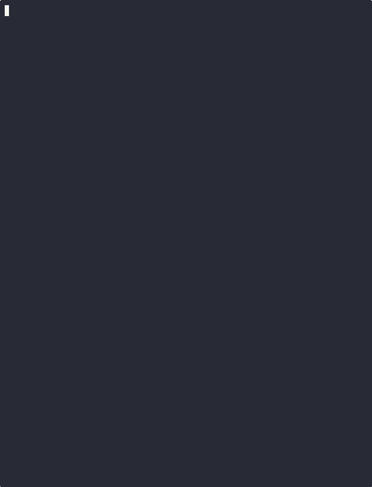

# sts2-cli

在终端里玩杀戮尖塔2。 [English](README.md)

通过反编译游戏 DLL + stub Godot 运行时，实现了无 GPU、无 UI 的完整游戏模拟。所有伤害计算、卡牌效果、敌人AI、遗物触发、随机数都和真实游戏一致。



## 安装

需要：
- [Slay the Spire 2](https://store.steampowered.com/app/2868840/Slay_the_Spire_2/) (Steam)
- [.NET 9+ SDK](https://dotnet.microsoft.com/download)
- Python 3.9+

```bash
git clone https://github.com/wuhao21/sts2-cli.git
cd sts2-cli
./setup.sh      # 从 Steam 复制 DLL → IL patch → 编译
```

或者直接运行 `python3 python/play.py`，首次会自动完成 setup。

## 玩

```bash
python3 python/play.py              # 中文交互模式
python3 python/play.py --lang en    # English
```

游戏内输入 `help` 查看所有命令：

```
  help     — 帮助
  map      — 显示地图
  deck     — 查看牌组
  potions  — 查看药水
  relics   — 查看遗物
  quit     — 退出

  地图:    输入编号 (0, 1, 2)
  战斗:    输入卡牌编号 / e 结束回合 / p0 使用药水
  奖励:    输入卡牌编号 / s 跳过
  休息:    输入选项编号
  事件:    输入选项编号 / leave 离开
  商店:    c0 买卡 / r0 买遗物 / p0 买药水 / rm 移除 / leave 离开
```

## 角色支持

| 角色 | 状态 |
|---|---|
| 铁甲战士 (Ironclad) | ✅ 完全可玩 |
| 静默猎手 (Silent) | ✅ 完全可玩 |
| 故障机器人 (Defect) | ✅ 完全可玩 |
| 亡灵契约师 (Necrobinder) | ✅ 完全可玩 |
| 储君 (Regent) | ✅ 完全可玩 |

## JSON 协议

除了交互模式，也可以通过 stdin/stdout JSON 协议编程控制（写 AI agent、RL 训练等）：

```bash
# 启动 headless 进程
dotnet run --project Sts2Headless/Sts2Headless.csproj
```

发送命令：
```json
{"cmd": "start_run", "character": "Ironclad", "seed": "test", "ascension": 0}
{"cmd": "action", "action": "play_card", "args": {"card_index": 0, "target_index": 0}}
{"cmd": "action", "action": "end_turn"}
{"cmd": "action", "action": "select_map_node", "args": {"col": 3, "row": 1}}
{"cmd": "action", "action": "skip_card_reward"}
{"cmd": "quit"}
```

每个命令返回一个 JSON decision point（`map_select` / `combat_play` / `card_reward` / `rest_site` / `event_choice` / `shop` / `game_over`），所有名称都是中英双语。

## 架构

```
你的代码 (Python / JS / LLM)
    │  JSON stdin/stdout
    ▼
Sts2Headless (C#)
    │  RunSimulator.cs
    ▼
sts2.dll (游戏引擎, IL patched)
  + GodotStubs (替代 GodotSharp.dll)
  + Harmony patches (本地化)
```
